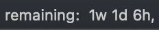

# markdown-plan

`markdown-plan` is a project planning syntax based on markdown. 

[Live demo](https://rexgarland.dev/app/markdown-plan/)

This extended syntax includes time estimates and time measurements, helping you improve your planning accuracy. It was designed for software freelancers who want to organize technical work on the scale of a few months or less, but I imagine it could be useful elsewhere.

Time estimates are given in three "t-shirt sizes" (small, medium and large) in order to (1) put a limit on expected precision and (2) encourage breaking up larger tasks into smaller:
```txt
. = 4 hours
.. = 2 days
... = 1 week
```

Time measurements are restricted to strings of the following characters:
```txt
h = 1 hour
a = 4 hours
d = 1 day
```

Example: app.plan.md

```md
# Build iOS app [by 12-1]
1. architecture planning [.] [hh]
2. prototyping
	- functional UI [..]
	- backend [...]
3. clean up visual design [.]
4. user tests / feedback [wait ..]
5. app store material [.]
	- write copy
	- create screenshots
	- add privacy policy
6. submit for review [wait ..]
```

[Sublime Text package](https://github.com/rexgarland/MarkdownPlan) for syntax highlighting and live summaries:



[Javascript implementation](https://github.com/rexgarland/markdown-plan-viewer) for running on the web.

Rendering in a terminal (**WIP**):


## Reference

### Plans

A markdown plan is a markdown file with the extension `plan.md`. Each header or list item is parsed as a "task."

Restrictions:
* The file must have exactly one title line (`# <title>`) at the start
* You cannot jump up more than one indentation level at a time in a nested list.
* You cannot jump up more than one header level from one header to the next.

The indentation restrictions are required in order to clearly denote parent-child relationships between tasks and create a directed acyclic graph (DAG), where the title task represents the only sink in the DAG.

### Tasks

Any line formatted as a list item or header is parsed as a task according to the following syntax.
```
- description [estimate] [measurements] [by <deadline>] @(dependencies)
```

There are two types of tasks:
- work
- wait (ones where the estimate has `wait` in it)

Examples:
```
1. complete paperwork [.] [hh]

- start online app [wait ..] [started 12-10]

## setup server [by 12-10] @(domain)
```

Details:
- An estimate is either:
	- an amount of work you have to do, e.g. `..`
	- a waiting period, e.g. `wait ..`
- A measurement is either:
	- a string of measurement characters (`h`, `a`, and `d`) and spaces or commas (which are just ignored)
	- a start date for a wait task, e.g. `started 12-10`
- A deadline is a month and day, e.g. `3-26`, prefaced by the `by` keyword
- Dependencies written in the `@()` syntax are explicit dependencies of the DAG that you can enter manually. They can be any unique substrings of another task's description, separated by commas for multiple dependencies. Note: be careful not to create a dependency loop (the parser should warn you anyway if you do).

## Contributing

**Issues and PRs welcome!**

## Acknowledgements

This project was inspired by Thomas Figg's "[Programming is Terrible](https://www.youtube.com/watch?v=csyL9EC0S0c)," Andrew Steel's [gantt](https://github.com/andrew-ls/gantt) repo, and Dave Farley's "[How to Estimate Software Development Time](https://www.youtube.com/watch?v=v21jg8wb1eU)."
