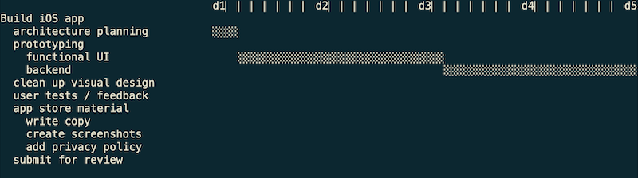

# markdown-plan
`markdown-plan` is a project planning syntax based on markdown. This extended syntax includes time estimates and time measurements, helping you improve your planning accuracy. It was designed for software freelancers who want to organize technical work, but I imagine it could be useful elsewhere.

```
# Bring up website [by 12-10]
- purchase domain {30 mins} [20 mins]
- prepare server
    1. rent server {1 hr}
    2. setup server {2-3 hours} [12-1:30pm, 2-3pm]
    3. push and run code {20 mins}
- connect domain to server @(domain, prepare server) {1 hr}
    - update dns records
    - secure website with https
```


(the tick mark scale is in hours)

## Installation

```
pip install markdown-plan
```

## Getting started

Download one of the example files in `examples/` and run `mdplan [file]` to make sure it works on your machine.

## Reference

### Plans

In `markdown-plan`, each "plan" is a text file, and each "task" is a markdown list item. A valid "markdown plan" must have two things:
1. a title line (starting with a single `#`)
2. a list of tasks

Lists can be nested ...
```
- new title
    1. finish paperwork
    2. mail paperwork
```
... and you can mix ordered and unordered lists together.
```
1. first this
2. then this
- this can happen any time
```

The title line is itself a task, so you can use any syntax as with a regular task.

### Tasks

Any line formatted as a list item is parsed as a task according to the following syntax.
```
* <description> {<estimate>} [<measurements>] [by <deadline>] [done|cancelled] @(<dependencies>)
```

Examples:
```
1. complete paperwork [30 min] [done]

- start online app {1-2 hrs} [12-1:30pm, 2-3pm] [done]

* setup server {2-3 hrs} [2.5 hrs] [by 12-10] @(server provider)
```

* An `{estimate}` can be the following:
	* duration (e.g. `{4 hours}`)
	* duration range (e.g. `{3-4 days}`)
* A `[measurement]` can be the following:
	* duration (e.g. `[1 hr]`)
	* time interval (e.g. `[11-12pm]`)
	* start or finish time (see waiting tasks below)
	* (Multiple measurements can be separated by commas within brackets (e.g. `[12-1, 3-4pm]`) or as separate brackets (e.g. `[12-1] [3-4pm]`))
* A deadline is denoted with the word `by` in brackets and can be the following:
	* date (e.g. `[by 12-10]`)
	* time (for items that should finish today) (e.g. `[by 1:30pm]` or `[by 13:30]`)
	* datetime (for greater precision) (e.g. `[by 12-10 at 1:30pm]`)
* A `[status]` can be
	* "done" for task completion
	* "cancelled" for ignoring a task

#### Waiting tasks

Tasks for which the time estimate is prefaced by `wait` are considering "waiting tasks." These are things like "wait for the mail to arrive," or tasks that take time but can happen concurrently to you own work. For example:

```
2. mail paperwork {wait 1-2 weeks} [started 12-10] [by 1-1]
```

The following measurements are used for waiting tasks:
* a start time (e.g. `[started 12-10]`)
* a finish time (e.g. `[finished 12-15]`)

You can also write a time duration instead of an ending time, if you prefer.

### Manual dependencies

For dependencies, you can write any unique substring of the referenced task. Tasks from another file can be referenced using a file prefix and a colon. For example:

`- start online app @(other: research)`

In this case, the file `./other.plan.md` (relative to the current file) is searched for a task containing the substring "research".

## More examples

`cd` into the `example` directory and try running `mdplan gantt` on any of the examples. 

## Future work

Tools for:
* viewing deadlines on the terminal gantt chart
* automatically scheduling tasks where order is ambiguous
* `--csv`: exporting everything as a csv

## Acknowledgements

This project was inspired by Thomas Figg's ["Programming is Terrible"](https://www.youtube.com/watch?v=csyL9EC0S0c) talk and Andrew Steel's [gantt](https://github.com/andrew-ls/gantt) repo.