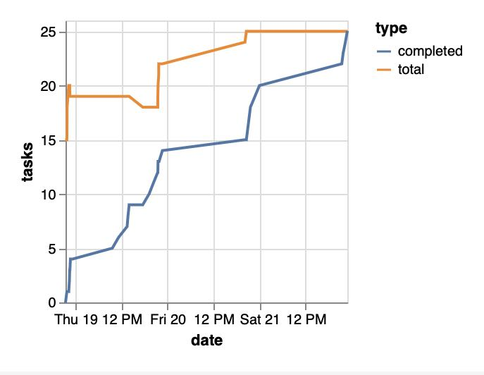
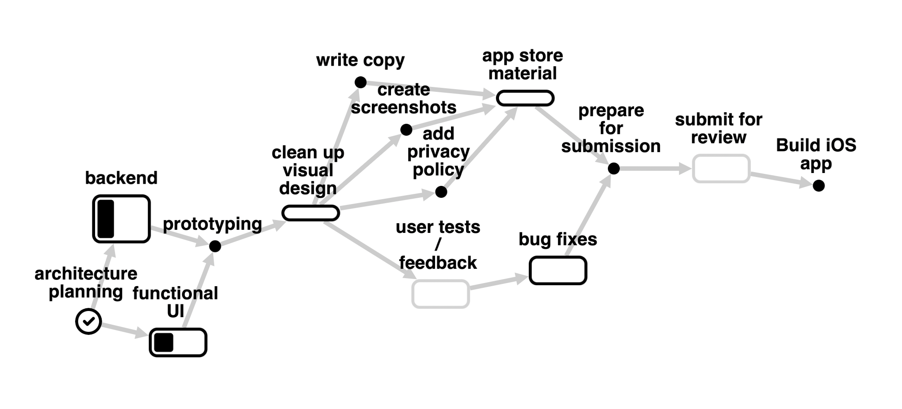
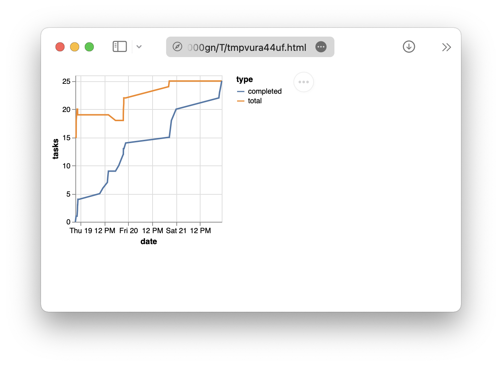

# markdown-plan

`markdown-plan` is a project planning syntax based on Markdown.

```md
# Example plan

1. [x] This task is done
2. This next task
   - With some sub-tasks
   - This one is unique
   - This one depends on @(unique)
```

Writing your plan in Markdown offers some unique benefits:

- Tracking it in version control
  - Plotting progress over time to calculate better ETAs
  - Documenting changes to the plan
- Visualizing a plan (e.g. as a DAG of tasks)
- Easily sharing a plan with others

All of these things make planning more transparent and, hopefully, fun.

## Examples

A [burn-up chart](https://en.wikipedia.org/wiki/Cumulative_flow_diagram) made from tracking a markdown plan in git


Vizualizing a markdown plan as a [DAG](https://en.m.wikipedia.org/wiki/Directed_acyclic_graph) of tasks


A Gantt chart generated from a markdown plan (i.e. [topological ordering](https://en.wikipedia.org/wiki/Topological_sorting))


## Syntax

Any line formatted as a list item or header is a task.

```md
# Title task

- child task
```

Everything else is ignored by default.

````md
- first task

This paragraph is ignored.

- second task

```
A code block, also ignored.
```
````

Tasks can be organized into hierarchical lists, ordered or unordered, with optional explicit dependencies using `@(...)`.

```md
- my task @(task1, task2)
```

Each dependency is a unique substring of the task it depends on.
The substring cannot include commas.

A task can be marked as "done" with a `[x]` at the beginning:

```

- [x] my finished task

```

### Parsing

Any valid plan can be parsed into a [tree](<https://en.wikipedia.org/wiki/Tree_(data_structure)>) or a [DAG](https://en.m.wikipedia.org/wiki/Directed_acyclic_graph), depending on the user's needs.

It is possible to create cyclic dependencies using the dependency notation above.
A plan with cyclic dependencies is not a valid plan.

## Tools

This repo ships with some basic CLI tools and a parsing library.

### Install

```sh
pip install markdown-plan
```

### Usage - command line

Changes to a plan can be tracked with `git`, where each commit effectively links a version of the plan to its timestamp.
This history can be used to make projections about when the plan will finish, or plot statistics over time.

```sh
mdplan history example.plan.md # outputs json
mdplan plot example.plan.md # opens a plot (using that json data)
```



### Usage - library

Users are encouraged to create their own tools as they see fit.
The parsing library is designed to be easily extended.

```python
from mdplan.parse import parse_tree

# ... get the plan text ...
tree = parse_tree(plan_text)

# count the leaves
num_tasks = len(tree.leaves)

# display the root task's description
root_node = tree.roots.pop()
task = root.value
print(task.description)

# ... see the Tree, Node, and Task classes for details
```

```python
from mdplan.git import GitHistory

# ... get the path to a plan ...
history = GitHistory(path)

# a history is just a chronological list of version
dates = [version.datetime for version in history]
trees = [version.tree for version in history]
statistics = [version.task_statistics for version in history]

# ... see the GitVersion class for more details
```

## Used by

- [markdown-plan-viewer](https://github.com/rexgarland/markdown-plan-viewer)

## Motivation

The main goal is to make planning easier and more useful.
Ultimately, planning should help us answer questions like:

- "When will this be done?"
- "How are we doing so far?"
- "What actually happened?"

Good plans should be:

- easy to create
- easy to adapt
- easy to share

Plans that are hard to read or write are difficult to share.

Plans that are easy to edit encourage adapting to change
This is especially true if each edit is easy to document and the history of edits is never lost.

If a plan is easy to parse, people are encouraged to build their own tools to help interpret the plan.

## Acknowledgements

This project was inspired by Thomas Figg's "[Programming is Terrible](https://www.youtube.com/watch?v=csyL9EC0S0c)," Andrew Steel's [gantt](https://github.com/andrew-ls/gantt) repo, Dave Farley's video "[How to Estimate Software Development Time](https://www.youtube.com/watch?v=v21jg8wb1eU)," and Allen Holub's talk "[No Estimates](https://www.youtube.com/watch?v=QVBlnCTu9Ms)" (itself inspired by the book by [Vasco Duarte](https://www.amazon.com/NoEstimates-Measure-Project-Progress-Estimating-ebook/dp/B01FWMSBBK)).
